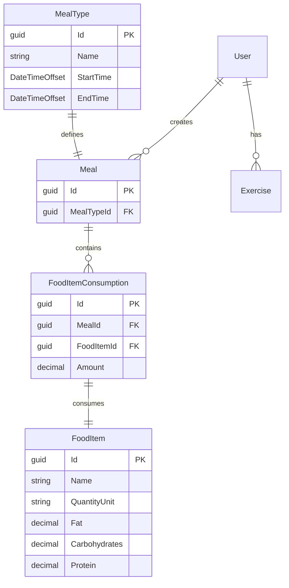

# ERD

```mermaid
erDiagram
    User ||--o{ Meal : creates
    MealType ||--|| Meal : defines
    Meal ||--o{ FoodItemConsumption : contains
    FoodItemConsumption ||--|| FoodItem : consumes
    User ||--o{ Exercise : has


    MealType {
        guid Id PK
        string Name
        DateTimeOffset StartTime
        DateTimeOffset EndTime
    }

    Meal {
        guid Id PK
        guid MealTypeId FK
    }

    FoodItemConsumption {
        guid Id PK
        guid MealId FK
        guid FoodItemId FK
        decimal Amount
    }

    FoodItem {
        guid Id PK
        string Name
        string QuantityUnit
        decimal Fat
        decimal Carbohydrates
        decimal Protein
    }
```